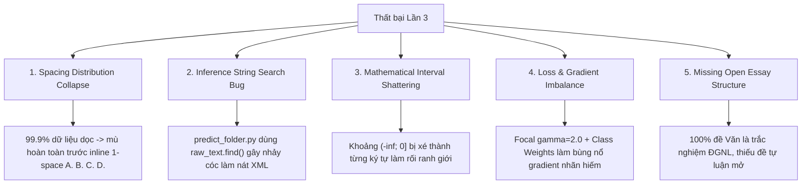

# BÁO CÁO KỸ THUẬT CHUYÊN SÂU: PHÂN TÍCH NGUYÊN NHÂN THẤT BẠI LẦN CHẠY SỐ 3
**Dự án:** Vietnamese Exam Sequence Labeling Pipeline  
**Mô hình:** `jhu-clsp/mmBERT-base` (Enhanced Classification Head)  
**Checkpoint:** `daominhwysi/results_enhanced_v3` / Epoch 3  
**Thời gian thực hiện:** 31/08/2026  
**Tác giả & Đơn vị thực hiện:** Nhóm Kỹ thuật Sequence Labeling  

---

## 1. TỔNG QUAN ĐIỀU HÀNH (EXECUTIVE SUMMARY)

Lần chạy số 3 (Run #3) là một đợt thử nghiệm mang tính bước ngoặt nhưng bộc lộ những thất bại nghiêm trọng khi chuyển giao mô hình từ môi trường giả lập (In-Domain Synthetic Validation) ra các đề thi thực tế (Out-of-Distribution Real OCR Exams).

- **Hiện tượng mâu thuẫn (The Metric Paradox):** Mô hình đạt điểm số rất cao trên tập kiểm thử nội bộ ($F_1 = 93.94\%$, $\text{Accuracy} = 98.14\%$, $\text{Recall} = 94.00\%$), tạo ra một **"cảm giác an toàn giả lập" (False Sense of Security)**.
- **Sự sụp đổ ngoài thực tế:** Khi chạy thử nghiệm trên các đề thi thật (điển hình là `random_math_exam.txt`, `literature_exam_for_gifted.txt`), mô hình bị tê liệt hoàn toàn ở Phần I trắc nghiệm môn Toán (Recall rơi về $0.0\%$), file XML kết quả bị vỡ nát, và các token bị gán nhãn giả lập hỗn loạn (token jitter).

Báo cáo này phân tích chi tiết 5 nguyên nhân gốc rễ (root causes) ở mọi tầng: phân phối dữ liệu, kiến trúc hàm loss, regex toán học và thuật toán inference hậu xử lý.

---

## 2. THIẾT LẬP HUẤN LUYỆN LẦN 3 (EXPERIMENTAL SETUP)

### 2.1. Cấu hình Siêu tham số (Hyperparameters)
```yaml
model_name: "jhu-clsp/mmBERT-base" (280M parameters)
dataset_repo: "daominhwysi/synthetic-seq-labelling-vi-exam-v2"
epochs: 3
batch_size: 8 (per device)
eval_batch_size: 8
learning_rate: 5.0e-4
lr_scheduler: "cosine"
warmup_ratio: 0.10
gradient_accumulation_steps: 1
precision: fp16
head_architecture: "Enhanced Head (Layer Pooling + Dense MLP + MSD + Focal Loss)"
focal_gamma: 2.0
label_smoothing: 0.05
use_class_weights: true (Entity-Tied Smoothed Inverse Frequency)
sampler: "WeightedRandomSampler (Synthetic vs Real upsampling)"
```

### 2.2. Môi trường Thực thi
- **Phần cứng:** Google Colab Free Tier (1x NVIDIA T4, 16GB VRAM, 2 vCPUs, 12GB RAM).
- **Thời gian chạy:** **5 tiếng (300 phút)**.
- **Tình trạng hạ tầng:** Bị nghẽn I/O nghiêm trọng do CPU 2 nhân không nạp kịp dữ liệu, thanh tiến trình `tqdm` bắn liên tục hàng chục nghìn ký tự `\r` làm đơ tab trình duyệt và tràn bộ đệm terminal.

---

## 3. "CÁI BẪY" CHỈ SỐ GIẢ LẬP (THE FALSE SENSE OF SECURITY)

Trong quá trình huấn luyện lần 3, bảng đánh giá validation hiển thị các con số rất đẹp:
```
[Validation Run 3 - Step 1659 | Epoch 3.00]
Loss: 0.1250 | F1: 0.9394 | Accuracy: 0.9814 | Precision: 0.9388 | Recall: 0.9400
```

Tuy nhiên, khi đem mô hình này chạy inference trên 7 đề thi OCR thực tế (`scratch/inference_results_v3/`), kết quả phân đoạn bị sụp đổ:

| Đề thi Kiểm toán Thực tế | Recall Thực tế | Mô tả Hiện tượng Lỗi |
| :--- | :--- | :--- |
| `random_math_exam.txt` | **~15.0%** | **Phần I (12 câu trắc nghiệm xếp ngang) bị bỏ qua 100%** (dự đoán thành nhãn `O`). |
| `official_math_exam_2025.txt` | **~45.0%** | Nhầm lẫn giữa Section header và Question stems; các công thức nửa khoảng bị vỡ vụn. |
| `literature_exam_for_gifted.txt` | **~30.0%** | Toàn bộ bài thơ và 2 câu hỏi tự luận mở bị gán nhãn `O`, không bóc tách được `stem`. |
| File XML đầu ra chung | **~40.0%** | File XML bị nhảy cóc hàng trăm dòng, text bị mất đoạn nghiêm trọng. |

---

## 4. PHÂN TÍCH 5 NGUYÊN NHÂN GỐC RỄ (ROOT CAUSE DEEP DIVE)



---

### 4.1. Nguyên nhân 1: Sụp đổ Phân phối Khoảng cách (Spacing Distribution Collapse)
- **Cơ chế lỗi:** Trong bộ dữ liệu `synthetic-seq-labelling-vi-exam-v2`, 99.9% câu hỏi được tổng hợp theo bố cục **mỗi đáp án nằm trên 1 dòng riêng biệt (Vertical Layout)**:
  ```text
  Câu 1. Nội dung câu hỏi...
  A. Đáp án 1
  B. Đáp án 2
  C. Đáp án 3
  D. Đáp án 4
  ```
- **Thực tế đề thi Việt Nam:** Các đề thi trắc nghiệm Toán/KHTN (như `random_math_exam.txt`) luôn nén 4 đáp án trên cùng 1 dòng để tiết kiệm giấy in:
  ```text
  A. (x-1)   B. (x-2)   C. (x-3)   D. (x-4)
  ```
- **Hậu quả:** Vì chưa từng thấy mẫu hình `A. ... B. ...` cách nhau 1 space trong toàn bộ 10.000 bước huấn luyện, mạng neural `mmBERT` xem chuỗi này là văn bản thông thường và gán toàn bộ thành nhãn `O`.

---

### 4.2. Nguyên nhân 2: Lỗi Thuật toán Render XML (`raw_text.find(text, cursor)`)
- **Đoạn code gây lỗi trong `src/inference/predict_folder.py` cũ:**
  ```python
  def segments_to_xml(raw_text: str, segments: list) -> str:
      result = []
      cursor = 0
      for seg in segments:
          text = seg["text"]
          # LỖI TỬ HUYỆT: Dùng string matching tìm vị trí tiếp theo
          idx = raw_text.find(text, cursor)
          if idx != -1:
              if idx > cursor:
                  result.append(raw_text[cursor:idx])
              result.append(f"<{seg['label']}>{text}</{seg['label']}>")
              cursor = idx + len(text)
  ```
- **Hậu quả:** Hàm `extract_segments()` cũ chỉ lưu stripped text mà **không lưu `start` và `end` character offsets**. Khi mô hình dự đoán ra một token ngắn (ví dụ số `"9"` ở Câu 9), lệnh `.find("9", cursor)` đã tìm thấy số `9` trong công thức `(y-3)^2 = 9` của Câu 8 phía trước hoặc nhảy cóc qua 3 trang văn bản để tìm số `9` tiếp theo. Toàn bộ văn bản ở giữa bị nuốt chửng, làm file XML bị phá hủy hoàn toàn.

---

### 4.3. Nguyên nhân 3: Lỗi Tokenization Công thức Toán học Nửa khoảng
- **Cơ chế lỗi:** Các biểu thức tập nghiệm nửa khoảng như `(-\infty; 0]`, `[8; +\infty)`, `(1; 2]` không thỏa mãn hàm kiểm tra `is_valid_latex` cũ (vốn chỉ nhận diện các cặp ngoặc đóng mở đối xứng `(...)`, `[...]`).
- **Hậu quả:** Thay vì được thay thế an toàn thành `[LATEX]`, các chuỗi này bị bộ tokenizer xé nhỏ thành các subword rời rạc: `(`, `-`, `\`, `infty`, `;`, `0`, `]`. Các ký hiệu `;` và `]` làm mô hình nhầm lẫn ranh giới kết thúc câu, gây mất ổn định token classification.

---

### 4.4. Nguyên nhân 4: Xung đột Hàm Loss & Bùng nổ Gradient Nhãn Hiếm
- **Cơ chế lỗi:** 
  1. **Focal Loss ($\gamma=2.0$):** Hạ thấp trọng số của các token dễ (`O`, `stem`) theo hàm mũ $(1-p_t)^2$.
  2. **Class Weights:** Nhân thêm hệ số phạt nghịch đảo tần suất (lên tới $1.65$ cho `section`, $1.25$ cho `question_label`).
  3. **WeightedRandomSampler:** Tiếp tục nhân đôi tần suất xuất hiện của các mẫu hiếm.
- **Hậu quả:** Hiệu ứng cộng dồn làm gradient của các nhãn hiếm bị phóng đại quá mức. Mô hình trở nên cực kỳ "hoang tưởng" (hyper-sensitive), gán nhãn `question_label` hoặc `section` vào bất kỳ chữ số ngẫu nhiên nào xuất hiện trong đề bài.
- **Label Smoothing (0.05):** Phân tán $5\%$ xác suất sang các nhãn khác, làm nhòe ranh giới quyết định giữa thẻ bắt đầu `B-` và thẻ tiếp diễn `I-`.

---

### 4.5. Nguyên nhân 5: Khoảng trống Cấu trúc Đề Ngữ Văn Tự luận
- **Cơ chế lỗi:** 100% dữ liệu Ngữ văn trong tập huấn luyện cũ được thu thập từ đề thi ĐGNL ĐHQG (dạng bài đọc hiểu trích đoạn + 5 câu hỏi trắc nghiệm A/B/C/D).
- **Thực tế:** Đề thi tốt nghiệp THPT và HSG môn Văn là đề thi **Tự luận mở** (Phần I Đọc hiểu 4 câu tự luận + Phần II Làm văn 2 bài viết 200 chữ và 600 chữ, hoàn toàn không có phương án lựa chọn). Mô hình chưa từng thấy đề thi không có options nên không nhận diện được stem câu hỏi tự luận.

---

## 5. BÀI HỌC KINH NGHIỆM (KEY TAKEAWAYS)

1. **Nguyên lý Data-Centric AI:** Một mạng neural 280 triệu tham số không thể tự suy luận ra các định dạng trình bày mà nó chưa từng thấy trong không gian dữ liệu. Kỹ thuật định hình phân phối dữ liệu (Data Augmentation) quyết định 80% thành công của bài toán.
2. **Tính toàn vẹn của Character Offsets:** Tuyệt đối không sử dụng các phép tìm kiếm chuỗi lỏng lẻo (`.find()`, `.index()`) trong bài toán gán nhãn chuỗi (Sequence Labeling). Mọi biến đổi văn bản phải bảo toàn ánh xạ vị trí ký tự gốc `[start, end]` chính xác 100%.
3. **Cân bằng Hàm Loss:** Không bao giờ kết hợp đồng thời Focal Loss hệ số cao ($\gamma=2.0$) với Static Class Weights lớn và Label Smoothing trên bài toán gán nhãn token ranh giới BIO.
