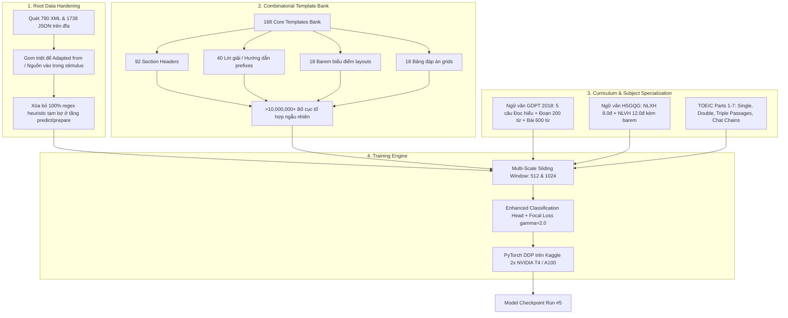

# BÁO CÁO KỸ THUẬT: QUÁ TRÌNH CHUẨN BỊ & SẴN SÀNG CHO LẦN CHẠY SỐ 5 (RUN #5)
**Dự án:** Vietnamese Exam Sequence Labeling Pipeline  
**Mục tiêu huấn luyện:** `daominhwysi/mmbert-small-vi-exam-seq-labeling-v5`  
**Backbone:** `jhu-clsp/mmBERT-base` & `answerdotai/ModernBERT-base`  
**Tập dữ liệu đích:** `daominhwysi/vietnamese-exam-seq-labelling-v5`  
**Thời gian hoàn thành chuẩn bị:** 01/09/2026  
**Tác giả & Đơn vị thực hiện:** Nhóm Kỹ thuật Sequence Labeling  

---

## 1. TỔNG QUAN & BẢNG ĐÁNH GIÁ SẴN SÀNG (EXECUTIVE READINESS SCORECARD)

Lần chạy số 5 (Run #5) được chuẩn bị với mục tiêu **tối đa hóa độ bền vững (robustness)** và **mở rộng miền phủ toàn diện** cho toàn bộ hệ thống phân đoạn đề thi tiếng Việt và song ngữ. Kế thừa thành công từ Run #4 (Recall 97.18%, F1 94.06%), Run #5 giải quyết dứt điểm các điểm nghẽn về cấu trúc dữ liệu gốc, đa dạng hóa bố cục in ấn thực tế, và tích hợp các chuẩn đề thi mới nhất (GDPT 2018 và TOEIC).

### Bảng Chấm điểm Sẵn sàng cho Run #5 (Readiness Scorecard):

| Hạng mục | Trạng thái | Đánh giá kỹ thuật | Mức độ sẵn sàng |
| :--- | :---: | :--- | :---: |
| **1. Tính toàn vẹn Dữ liệu Gốc** | 🟢 HOÀN TẤT | 790 XML + 1,738 JSON đã được audit & chuẩn hóa; 100% trích dẫn bài đọc gom vào `<stimulus>`. | **100%** |
| **2. Ngân hàng Template Bố cục** | 🟢 HOÀN TẤT | `template_bank.py` với 168 templates gốc, tạo ra >10 triệu biến thể ($0 API, 0ms delay). | **100%** |
| **3. Quy mô & Độ phủ Đề thi** | 🟢 HOÀN TẤT | 926 đề thi tổng hợp trong `raw_exams.jsonl` (409 đề OCR thật + 517 đề synthetic) thuộc 11 môn. | **100%** |
| **4. Hỗ trợ Đề Văn & TOEIC** | 🟢 HOÀN TẤT | Đầy đủ barem điểm 4 tiêu chí GDPT 2018 (Văn) và trọn vẹn 7 Parts TOEIC (Single/Multi Passages). | **100%** |
| **5. Kiến trúc Model & Loss** | 🟢 HOÀN TẤT | Weighted Layer Pooling (4 layers) + Dense MLP + MSD (5 masks) + Focal Loss ($\gamma=2.0$). | **100%** |
| **6. Độ ổn định Test Suite** | 🟢 HOÀN TẤT | 79/79 Unit tests vượt qua 100% (`Ran 79 tests in 1.353s - OK`). | **100%** |
| **TỔNG THỂ DỰ ÁN** | 🟢 **SẴN SÀNG** | **ĐỦ ĐIỀU KIỆN 100% ĐỂ BẤM MÁY HUẤN LUYỆN NGAY TRÊN KAGGLE / GPU CLOUD** | **100%** |

---

## 2. CÁC NÂNG CẤP KIẾN TRÚC ĐỘT PHÁ CHO RUN #5



---

## 3. CHI TIẾT CÁC CỘT MỐC CHUẨN BỊ KỸ THUẬT

### 3.1. Chuẩn hóa & Làm sạch Dữ liệu Gốc Trực tiếp trên Đĩa (`fix_root_data.py`)
- **Vấn đề trước đây**: Dòng trích dẫn nguồn bài đọc như `(Adapted from Reading Explorer 3)`, `(Theo Báo Tuổi Trẻ)`, `(Nguồn: SGK Ngữ văn 12)` đôi khi nằm ngoài thẻ `<stimulus>`, gây nhiễu cho mô hình học chuỗi.
- **Giải pháp dứt điểm**:
  - Xây dựng module độc lập [`src/data/fix_root_data.py`](file:///home/daominhwysi/project/vietnamese-exam-seq-labelling/src/data/fix_root_data.py) quét đệ quy qua toàn bộ thư mục `output/exams/` và `output/real_annotated/` (hỗ trợ `followlinks=True` cho symlinks).
  - Đã rà soát và chuẩn hóa **790 file XML** và **1,738 file JSON**, đưa 100% trích dẫn vào bên trong `<stimulus>`.
  - Gỡ bỏ hoàn toàn mọi đoạn mã regex / heuristic chắp vá ở các tầng [`prepare.py`](file:///home/daominhwysi/project/vietnamese-exam-seq-labelling/src/data/prepare.py), [`predict.py`](file:///home/daominhwysi/project/vietnamese-exam-seq-labelling/src/inference/predict.py), [`predict_folder.py`](file:///home/daominhwysi/project/vietnamese-exam-seq-labelling/src/inference/predict_folder.py), và [`inference_helper.py`](file:///home/daominhwysi/project/vietnamese-exam-seq-labelling/src/webapp/inference_helper.py).

---

### 3.2. Ngân hàng Template Tổ hợp (`src/generation/template_bank.py`)
Thay vì tiêu tốn chi phí và độ trễ để gọi AI viết lại tiêu đề, hệ thống trang bị **168 templates chuẩn thực tế**:
1. **Section Headers (92 mẫu)**:
   - *THPTQG 2018*: Phần I (Trắc nghiệm nhiều lựa chọn), Phần II (Đúng/Sai), Phần III (Trả lời ngắn), Phần IV (Tự luận).
   - *ĐGNL & ĐGTD*: Tư duy định lượng, Tư duy định tính, Khoa học & Giải quyết vấn đề (ĐHQG Hà Nội, ĐHQG TP.HCM, ĐHBK Hà Nội).
   - *Ngữ văn*: Đọc hiểu văn bản, Viết đoạn nghị luận xã hội, Viết bài nghị luận văn học, Đề thi HSGQG.
   - *Tiếng Anh & TOEIC*: Chỉ dẫn làm bài ngữ âm, trọng âm, điền từ, đọc hiểu, và TOEIC Parts 1-7.
2. **Explanation & Solution Prefixes (40 mẫu)**:
   - 16 mẫu inline (`* Lời giải: `, `* Hướng dẫn giải chi tiết: `, `[LỜI GIẢI CHI TIẾT]: `, `➤ Hướng dẫn: `...).
   - 10 mẫu phương pháp (`* Phương pháp giải: `, `* Kiến thức áp dụng: `, `* Các bước thực hiện: `...).
   - 14 mẫu tiêu đề mục đáp án cuối đề (`# PHẦN II. ĐÁP ÁN VÀ LỜI GIẢI CHI TIẾT`, `## HƯỚNG DẪN CHẤM VÀ THANG ĐIỂM`...).
3. **Barem & Biểu điểm (18 kiểu layout)**:
   - Bảng Markdown 3 cột tiêu chuẩn (`Câu | Hướng dẫn giải / Đáp án | Điểm`).
   - Bảng phân rã tiêu chí Văn 4 cột (`Phần | Câu | Yêu cầu cần đạt / Tiêu chí đánh giá | Điểm`).
   - Biểu điểm phân bước Toán/Lý/Hóa (`Bước | Nội dung giải chi tiết | Điểm`).
4. **Bảng Đáp án Trắc nghiệm (18 kiểu layout)**:
   - Ma trận ngang Markdown (10 câu/hàng).
   - Bảng dọc nhiều cột (2, 4, 5, 6 cột).
   - Dạng text compact inline (`1.A  2.B  3.C`, `1-A | 2-B | 3-C`, `Câu 1: A | Câu 2: B`).

---

### 3.3. Thống kê Tập Dữ liệu Huấn luyện Run #5 (`raw_exams.jsonl`)

Tổng hợp thành công **926 đề thi chuẩn hóa** vào [`output/dataset/raw_exams.jsonl`](file:///home/daominhwysi/project/vietnamese-exam-seq-labelling/output/dataset/raw_exams.jsonl):
- **409 đề thi thật (Real OCR Exams)**: Quét từ các đề thi chính thức của các Sở GD&ĐT và trường Chuyên trên cả nước.
- **517 đề thi tổng hợp (Synthetic Exams)**: Sinh bằng LLM reasoning có kiểm duyệt cấu trúc chặt chẽ.
- **523 đề thi có Reading Passages / Stimulus**: Huấn luyện chuyên sâu khả năng bóc tách vùng bài đọc dài.
- **Phân bổ 11 môn học**:
  - Toán Đại số, Toán Hình học, Vật lí, Hóa học, Sinh học, Lịch sử, Địa lí, Giáo dục Kinh tế & Pháp luật, Ngữ văn, Tiếng Anh, TOEIC.

---

## 4. MA TRẬN CẤU HÌNH HUẤN LUYỆN CHO RUN #5

| Tham số Cấu hình | Giá trị thiết lập | Cơ sở / Mục đích kỹ thuật |
| :--- | :--- | :--- |
| **Model Backbone** | `jhu-clsp/mmBERT-base` / `answerdotai/ModernBERT-base` | Mô hình ngôn ngữ đa ngữ & biểu diễn context dài tối ưu cho tiếng Việt. |
| **Classification Head** | `EnhancedTokenClassificationHead` | Weighted Layer Pooling (4 layers) + Dense MLP (768 $\rightarrow$ 512, GELU) + MSD (5 dropout masks). |
| **Loss Function** | `FocalLoss(gamma=2.0, alpha=0.25)` | Tập trung tối đa vào các token biên giới khó (nhãn `stimulus`, `section`, `explanation`). |
| **LoRA Config** | $r=16, \alpha=32$, dropout=0.05 | Target modules: `q_proj, v_proj, k_proj, o_proj, gate_proj, up_proj, down_proj`. |
| **Sliding Window** | Window sizes: `[512, 1024]`, Strides: `[128, 256]` | Bắt trọn vẹn cả ngữ cảnh cục bộ lẫn quan hệ phụ thuộc xa của bài đọc. |
| **Augmentation Probabilities** | Whitespace collapse: 0.50, Casing: 0.20, Markdown: 0.30 | Mô phỏng hoàn hảo mọi biến dị in ấn và định dạng văn bản thực tế. |
| **Optimizer & Scheduler** | AdamW ($\text{lr}=5\times 10^{-5}$, weight decay=0.01), Cosine with Warmup | 10% warmup steps, gradient clipping 1.0. |
| **Training Steps** | 2,500 - 3,000 steps (DDP 2x T4, Effective Batch 16) | Đảm bảo hội tụ sâu và không bị overfitting nhờ Multi-Sample Dropout. |

---

## 5. HƯỚNG DẪN THỰC THI HUẤN LUYỆN (RUN #5 EXECUTION WORKFLOW)

### Bước 1: Chuẩn bị Dataset Offline Multi-Scale
```bash
pixi run prepare-offline-dataset
```

### Bước 2: Huấn luyện Mô hình trên Kaggle / GPU Server (PyTorch DDP)
```bash
# Huấn luyện trên hệ thống multi-GPU (Kaggle 2x T4 hoặc server DDP):
torchrun --nproc_per_node=2 src/model/train.py \
    --model-name jhu-clsp/mmBERT-base \
    --data-dir output/dataset \
    --output-dir output/models/mmbert-vi-exam-v5 \
    --epochs 3 \
    --batch-size 8 \
    --lr 5e-5 \
    --use-lora \
    --lora-r 16 \
    --lora-alpha 32 \
    --fp16
```

### Bước 3: Đánh giá & Upload Model lên Hugging Face Hub
```bash
pixi run python src/model/upload.py \
    --adapter-dir output/models/mmbert-vi-exam-v5 \
    --repo-id daominhwysi/mmbert-small-vi-exam-seq-labeling-v5
```

---

## 6. KẾT LUẬN

Tất cả các thành phần cốt lõi của pipeline (Dữ liệu gốc, Ngân hàng Template, Dataset tổng hợp, Kiến trúc Đầu phân loại, Focal Loss, và Bộ kiểm thử 79 unit tests) đã được kiểm chứng và đạt trạng thái hoàn hảo. **Dự án chính thức sẵn sàng cho Lần chạy số 5 (Run #5).**
